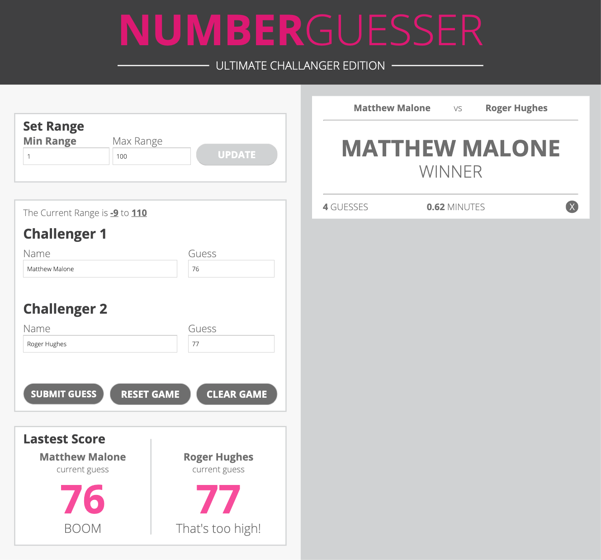
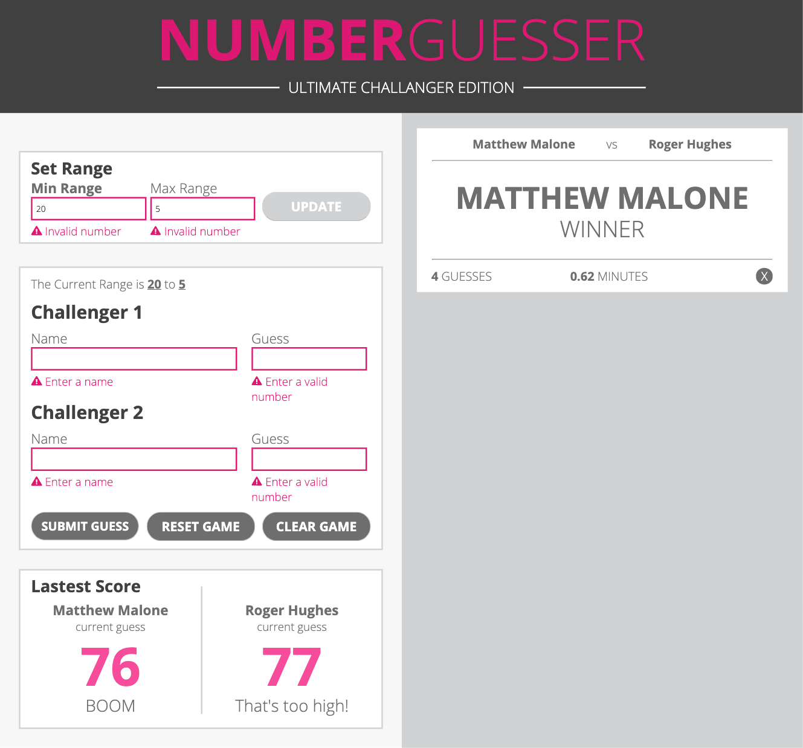

# Number Gusser Project

## Table of contents
* Built With 
* Screenshots
* Features
* Try It Out
* Take It For A Spin
* Why'd We Do This?

## Built With

- HTML5
- CSS3
- JavaScript

## Screenshots
### Prompts:
  
  
  
  
### Actual:
  
  
  

## Features

- [x] Altering page content via input fields (JS)
- [x] Responsive (CSS Media Query with 2 break points)
- [x] Logic to create random number
- [x] Logic to compare guess to random guess and give accurate feedback
- [x] Use of event listeners at the parent level(bubbling)

## Try It Out

1. Grab a friend and get prepared to be WOWED!

2. By default, there is a random number generated between 1-100, so you can start playing, or go ahead and choose a custom range

3. Enter your names and guesses, and you'll get feedback if you're too high or too low.

4. Once you hit the number look for your custom card to pop up showing you won with how many guesses and time taken to get there!

5. We heard you, you don't want to lug your laptop around everywhere to play. Just pull out your cell phone or tablet, and you'll be the hit and making new friends where ever you go with this game.

6. If you don't guess within the range, you'll know. You'll also know if you try to play anonymously (not entering a name) or not entering a number.

## Take It For A Spin

View <a href="https://rahughes.github.io/Snacks-Roger-NG/">here</a> on GitHub.

OR 

Download and unzip the Snacks-Roger-NG.zip file, and open the index.html file to view the website.

## Why'd We Do This?

Roger and Matthew are students at Turing School of Software and Design, whom provioded the project specifications and website design.

